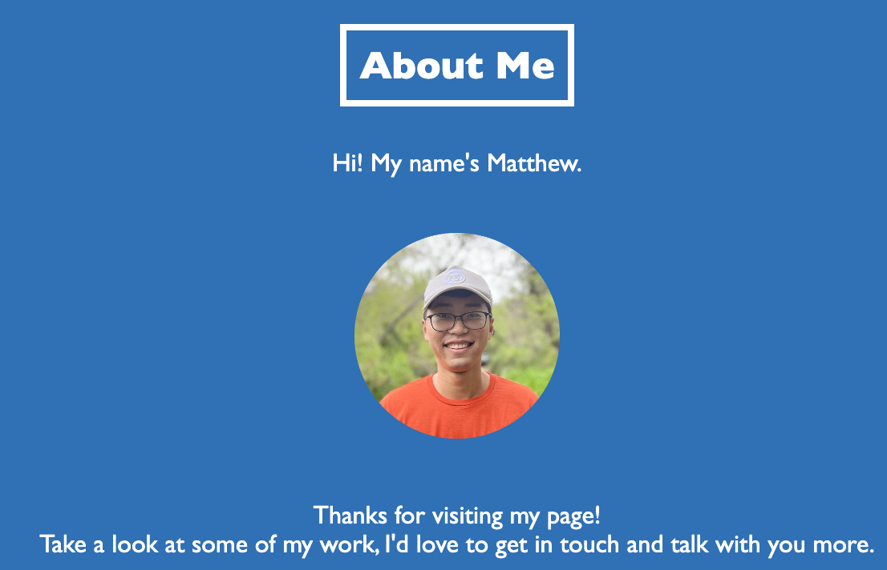
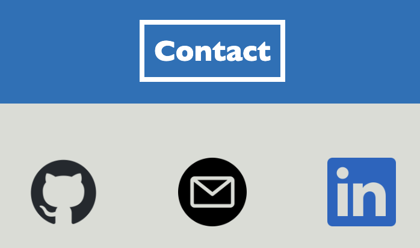

# <Portfolio>

## Description

- Showcase web development skills to potential employer by demonstrating that I can build a website portfolio.
- The portfolio is dual-purpose and will showcase recent projects to display a variety of programming languages and concepts.
- The work section contains test pictures, titles, descriptions, and links. These will later be updated to reflect actual work projects.

## Table of Contents (Optional)

- [Usage](#usage)
- [Credits](#credits)

## Usage

Below is a screenshot of the website portfolio and the navbar at the top right that will link to the corresponding section when clicked.

The three sections (about me, work, and contact):

## Credits

<a href="https://www.flaticon.com/free-icons/email" title="email icons">Email icons created by Uniconlabs - Flaticon</a>